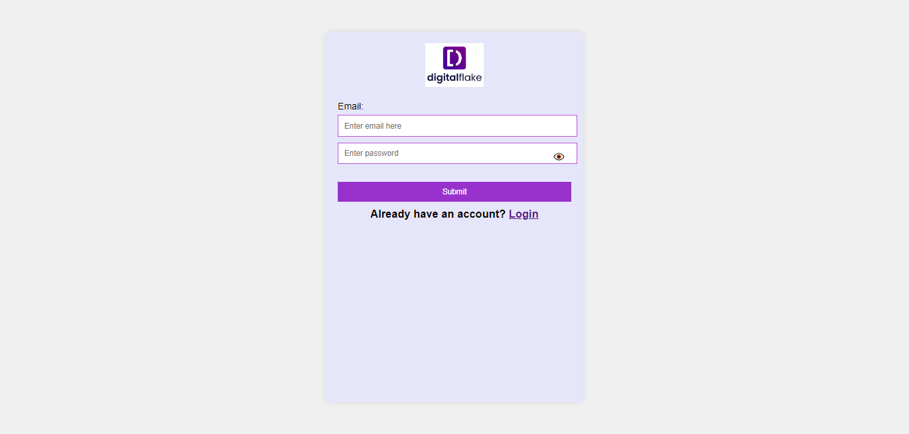
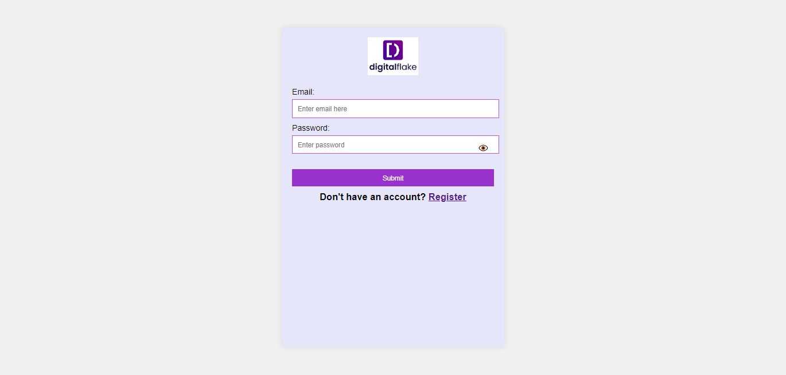
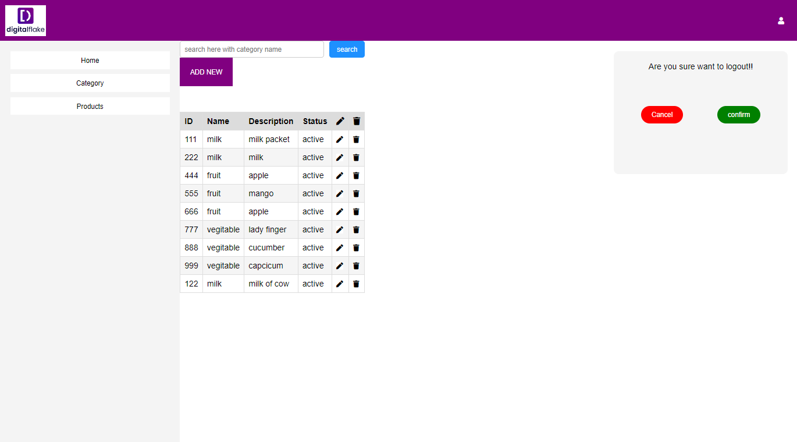
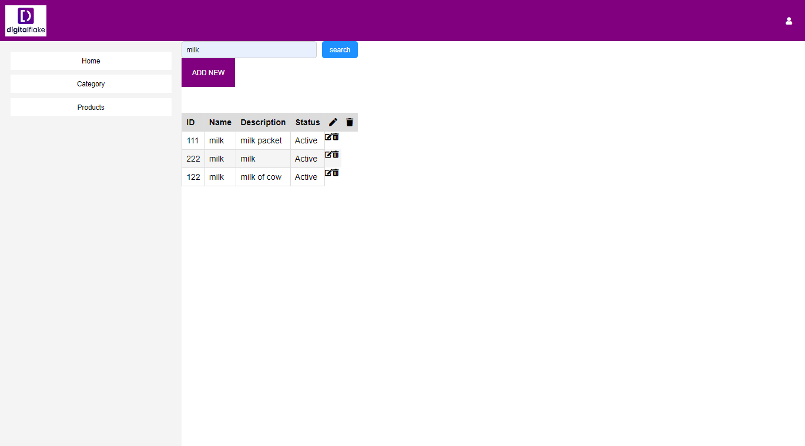
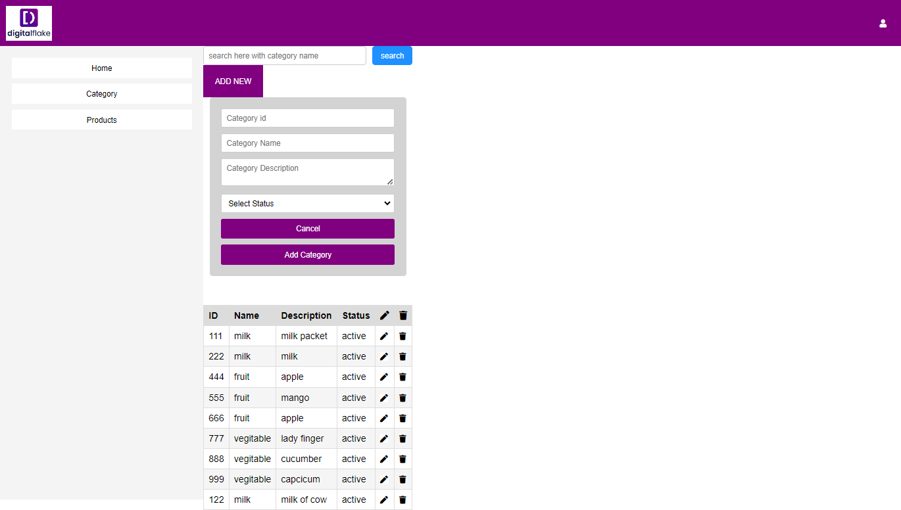
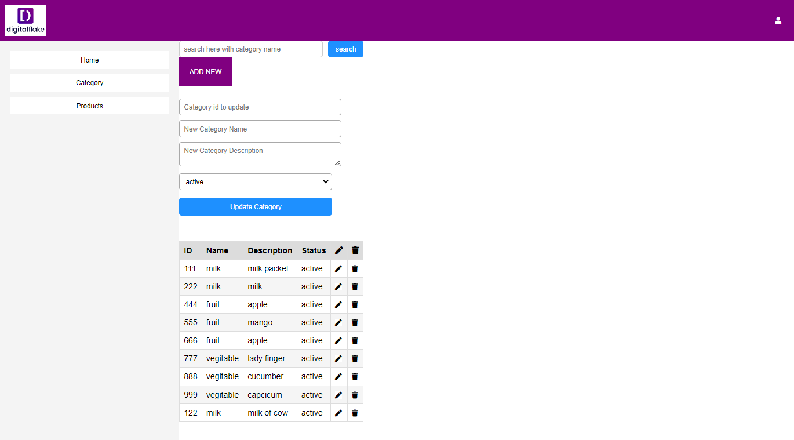
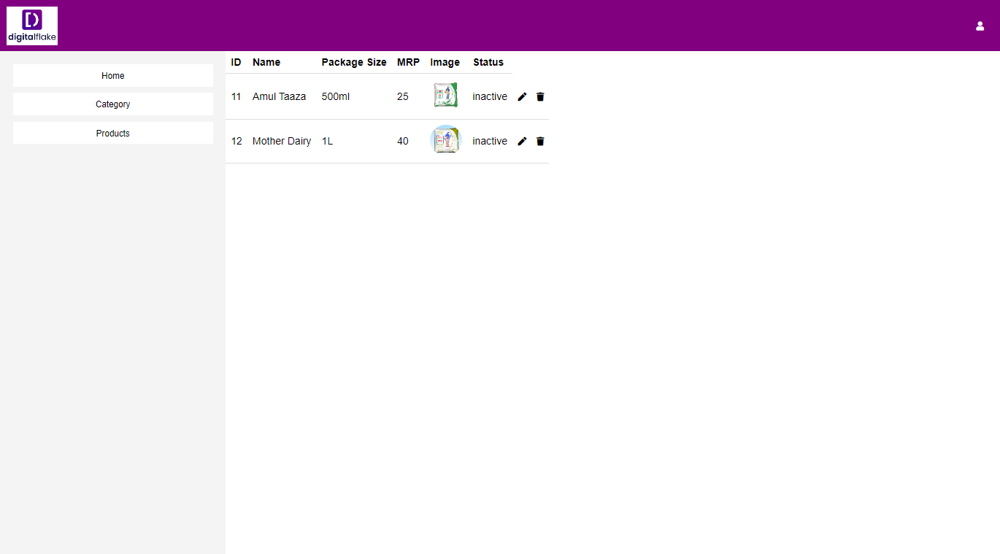

## Installation

1. Clone the repository: `git clone https://github.com/8309h/digital_flake_hakethon.git`
2. Navigate to the project directory: `cd Backend`
3. Install dependencies: `npm install`
4. Set up environment variables: Create a `.env` file in the root directory and add the following variables:
   ```
   PORT=3000
   MONGODB_URI=your_mongodb_connection_string
   JWT_SECRET=your_jwt_secret_key
   ```
5. Start the server: `npm run server`

## Usage

To use Digital Flake:

1. Register a new user using the `/user/register` endpoint.
2. Log in using the `/user/login` endpoint to receive a JWT token.
3. Use the token to authenticate requests to protected routes.
4. Administrators can manage categories and products using the appropriate routes.

### Routes

#### User Routes

- **POST /user/register**: Register a new user.
- **POST /user/login**: Log in a user and receive a JWT token.
- **POST /user/logout**: Log out a user.

#### Category Routes

- **GET /category/getall**: Get all categories.
- **POST /category/addnew**: Add a new category.
- **DELETE /category/delete/:id**: Delete a category by ID.
- **PATCH /category/update/:id**: Update a category by ID.
- **GET /category/search**: Search for categories by name.

#### Product Routes

- **POST /product/create**: Create a new product.
- **GET /product/getallproduct**: Get all products.
- **GET /product/getbyId/:id**: Get a product by ID.
- **PATCH /product/update/:id**: Update a product by ID.
- **DELETE /product/delete/:id**: Delete a product by ID.


### Frontend Tech Stack

- **Languages**: HTML, CSS, JavaScript (Vanilla)
- **Styling**: CSS with Sass/SCSS (optional)
- **HTTP Requests**: Fetch API or XMLHttpRequest
- **Routing**: Vanilla JavaScript for simple routing (or any lightweight routing library)
- **Authentication**: LocalStorage or sessionStorage for storing tokens
- **Icons**: Font Awesome or custom icon sets
- **Version Control**: Git with GitHub or GitLab

### Backend Tech Stack

- **Framework**: Express.js for handling HTTP requests and routing
- **Database**: MongoDB for storing data, with Mongoose for object modeling
- **Authentication**: JWT (JSON Web Tokens) for user authentication
- **Security**: bcrypt for password hashing
- **Middleware**: Helmet for securing HTTP headers, Cors for handling Cross-Origin Resource Sharing
- **Version Control**: Git with GitHub or GitLab


## Screenshots

Include screenshots of your application in action:
# Register
- 
# Login 
- 
# Category
- 
# Search Category
- 
# Add new Category 
- 
# Update Category
- 
# Logout 
- 
# Get Product Section
- 


